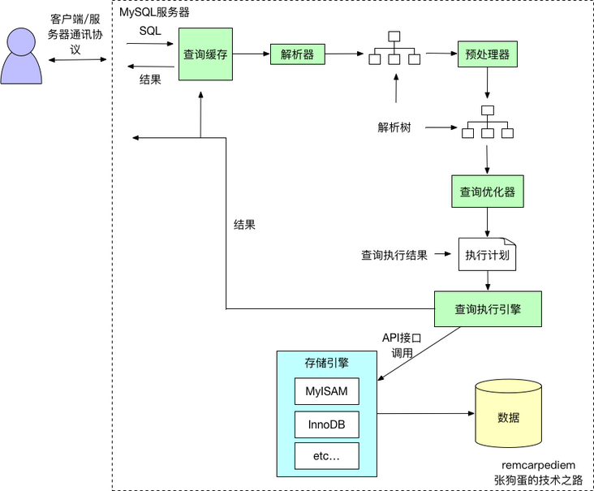

# mysql数据库

## SQL

### SQL语法

### 插入防报错

#### replace into

> replace into 首先尝试插入数据到表中。 如果发现表中已经有此行数据(根据主键或者唯一索引判断)则先删除此行数据，然后插入新的数据，否则，直接插入新数据。

##### 缺点

 其实是先删除再插入,如果已存在记录,自增id会改变

#### insert ignore into

> insert ignore会忽略数据库中已经存在的数据(根据主键或者唯一索引判断)，如果数据库没有数据，就插入新的数据，如果有数据的话就跳过这条数据. 

##### 缺点

 主键还是会自动增长 

####  on duplicate key update

> 如果在insert into 语句末尾指定了on duplicate key update，并且插入行后会导致在一个UNIQUE索引或PRIMARY KEY中出现重复值，则在出现重复值的行执行UPDATE；如果不会导致重复的问题，则插入新行，跟普通的insert into一样。

##### 缺点

可能会造成死锁问题。 参考： [MySQL5.7并发INSERT ON DUPLICATE KEY UPDATE导致死锁 - hebaodan的博客 - OSCHINA - 中文开源技术交流社区](https://my.oschina.net/hebaodan/blog/3045246) 

### SQL执行过程

### SQL执行顺序

- 执行FROM语句
- 执行ON过滤
- 添加外部行
- 执行WHERE过滤
- 执行GROUP BY分组
- 执行HAVING过滤
- SELECT列表
- 执行DISTINCT子句
- 执行ORDER BY子句

### SQL优化

#### explain

- id 执行计划的id顺序

> 如果id相同，则从上往下执行
>
> 如果id不通，则依据id从大向小执行

- partitions 分区

- type 连接类型

> - ALL：Full Table Scan， MySQL将遍历全表以找到匹配的行
> - index: Full Index Scan，index与ALL区别为index类型只遍历索引树
> - range:只检索给定范围的行，使用一个索引来选择行
> - ref: 表示上述表的连接匹配条件，即哪些列或常量被用于查找索引列上的值
> - eq_ref: 类似ref，区别就在使用的索引是唯一索引，对于每个索引键值，表中只有一条记录匹配，简单来说，就是多表连接中使用primary key或者 unique key作为关联条件
> - const、system: 当MySQL对查询某部分进行优化，并转换为一个常量时，使用这些类型访问。如将主键置于where列表中，MySQL就能将该查询转换为一个常量，system是const类型的特例，当查询的表只有一行的情况下，使用system
> - NULL: MySQL在优化过程中分解语句，执行时甚至不用访问表或索引，例如从一个索引列里选取最小值可以通过单独索引查找完成

- possible_keys 可能使用的索引
- key 实际使用的索引
- ref 连接类型
- Extra 

> Using where:不用读取表中所有信息，仅通过索引就可以获取所需数据，这发生在对表的全部的请求列都是同一个索引的部分的时候，表示mysql服务器将在存储引擎检索行后再进行过滤
>
> Using temporary：表示MySQL需要使用临时表来存储结果集，常见于排序和分组查询，常见 group by ; order by
>
> Using filesort：当Query中包含 order by 操作，而且无法利用索引完成的排序操作称为“文件排序”
>
> Using join buffer：改值强调了在获取连接条件时没有使用索引，并且需要连接缓冲区来存储中间结果。如果出现了这个值，那应该注意，根据查询的具体情况可能需要添加索引来改进能。
>
> Impossible where：这个值强调了where语句会导致没有符合条件的行（通过收集统计信息不可能存在结果）。
>
> Select tables optimized away：这个值意味着仅通过使用索引，优化器可能仅从聚合函数结果中返回一行
>
> No tables used：Query语句中使用from dual 或不含任何from子句

## 索引

### 索引类型

#### 主键索引

#### 普通索引

#### 唯一索引

#### 组合索引

#### 全文索引

### 索引数据结构

#### B+树

##### B树和B+树的区别

- B树的每个节点都直接存储数据,B+树只有叶子节点存储数据
- B树同一层级兄弟节点之间无指针关联,B+树兄弟节点有指向下一节点的指针

##### 为什么mysql使用B+树,mongoDb使用B树?

- mysql是关系型数据库,经常要做遍历和范围查找操作,所以有兄弟指针,以及内部节点不存储都可以使每一个节点都存储更多的行
- mongoDb是非关系型数据库,其主要用来做单一数据查询,对遍历和关联查询要求较小,直接存储数据可以提高效率

#### 聚簇索引

#### 非聚簇索引

### 不走索引的情况

- 使用了 ！=或<> （主键和整数索引还是可以走）
- 使用了 is null或者 is not null或= null
- 使用了函数
- join时字段数据类型不同
- like时不是前缀匹配
- 数据类型不匹配需要自动转换（如字段为字符串查询时使用数字）
- OR条件不是全部都有索引

## 数据库事务

### ACID特性

####  原子性(Atomicity) 

>  事务中的所有操作作为一个整体像原子一样不可分割，要么全部成功,要么全部失败。
>
> 通过事务-commit-rollback实现 

####  一致性(Consistency) 

>  事务的执行结果必须使数据库从一个一致性状态到另一个一致性状态。一致性状态是指:1.系统的状态满足数据的完整性约束(主码,参照完整性,check约束等) 2.系统的状态反应数据库本应描述的现实世界的真实状态,比如转账前后两个账户的金额总和应该保持不变。 
>
> 通过业务逻辑实现

####  隔离性(Isolation) 

>  并发执行的事务不会相互影响,其对数据库的影响和它们串行执行时一样。比如多个用户同时往一个账户转账,最后账户的结果应该和他们按先后次序转账的结果一样。 
>
> 通过隔离级别实现

####  持久性(Durability) 

>  事务一旦提交,其对数据库的更新就是持久的。任何事务或系统故障都不会导致数据丢失。 
>
> 通过数据文件、binlog日志、redo日志和undo日志实现

### 锁

参考文章  [你应该了解的MySQL锁分类 - SegmentFault 思否](https://segmentfault.com/a/1190000023869573) 

#### X锁

#### S锁

#### MVCC

- mysql通过redo log实现了版本快照，redo log存储了历史版本的数据，以链表方式存放
- 数据库中的隐式字段
  - DB_TRX_ID 6byte，最近修改(修改/插入)**事务ID**：记录创建这条记录/最后一次修改该记录的事务ID
  - DB_ROLL_PTR 7byte，**回滚指针**，指向这条记录的上一个版本（存储于rollback segment里）
  - DB_ROW_ID 6byte，**隐含的自增ID**（隐藏主键），如果（当且仅当）数据表没有主键，InnoDB会自动以DB_ROW_ID产生一个聚簇索引

#### 行锁兼容矩阵

- 间隙锁(Gap Lock)：只锁间隙，前开后开区间(a,b)，对索引的间隙加锁，防止其他事务插入数据。
- 记录锁(Record Lock)：只锁记录，特定几行记录。
- 临键锁(Next-Key Lock)：同时锁住记录和间隙，前开后闭区间(a,b]。
- 插入意图锁(Insert Intention Lock)：插入时使用的锁。在代码中，插入意图锁，实际上是GAP锁上加了一个LOCK_INSERT_INTENTION的标记。  

#### 什么情况下会导致锁表? 如何解决?

### 事务隔离级别

| 事务级别                  | 脏读 | 不可重复读 | 幻读 |
| :------------------------ | :--- | :--------- | :--- |
| Read uncommitted 读未提交 | √    | √          | √    |
| Read committed 读已提交   | ×    | √          | √    |
| Repeatable read 可重复读  | ×    | ×          | √    |
| Serializable 串行化       | ×    | ×          | ×    |

#### 读未提交

- 简述：一个事务可以读取另一个事务未提交的数据
- 问题：如果另一个事务执行了回滚，则会导致数据异常

#### 读已提交

- 简述：一个事务可以读取另一个事务已提交的数据
- 问题：一个事务中的两次读取结果会不同

#### 可重复读

- 简述：一个事务中查询的数据不管在执行过程中是否被修改，读取的数据始终一致
- 问题：

#### MySQL RR级别是如何解决幻读的？

- 通过临键锁next-key lock

#### 临键锁的死锁问题

- 正常的读写锁之间的互斥关系我们很清楚，但是间隙锁呢， 间隙锁与间隙锁之间是不互斥的。 就是一个事务A锁住了（0，100]的间隙锁，那么B事务也可以重复获取（0，100]的间隙锁。
- 上面两个事务都获取了间隙锁， 这个时候如果A事务要在这个间隙之间插入一条记录，会阻塞，因为B事务间隙锁了， 同样B事务也不能操作这个间隙了。 这样就导致了两个线程形成死锁了。
- 这就是代价，是InnoDB解决幻读的代价。

#### 第一类数据丢失和第二类数据丢失

- 第一类数据丢失指读取到了将来会被回滚的数据（读未提交的情况）
- 第二类数据丢失指提交的更新被覆盖了（RC、RR级别）

#### RR级别会出现数据丢失吗？

- 会。并行状态下后开启事务但是先提交事务的更新记录不会被先开启的事务读取到

### 事务传播级别

## 参考文章

### 数据库事务

 [数据库事务的概念及其实现原理 - takumiCX - 博客园 (cnblogs.com)](https://www.cnblogs.com/takumicx/p/9998844.html) 

