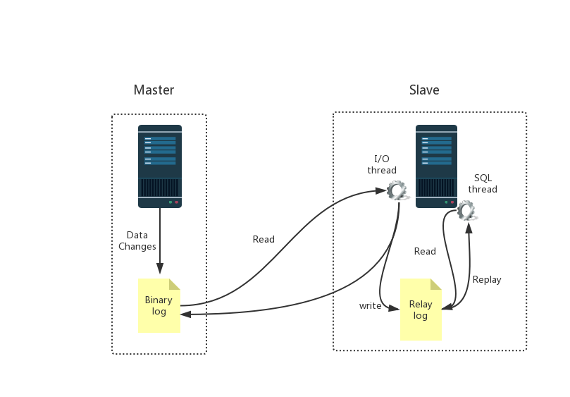
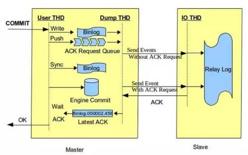

## mysql数据库集群搭建

### 主从同步原理

#### 主从同步的形式

- 在master机器上，主从同步事件会被写到特殊的log文件中(binary-log);主从同步事件有3种形式:statement、row、mixed。
  - statement：会将对数据库操作的sql语句写入到binlog中。
  - row：会将每一条数据的变化写入到binlog中。
  - mixed：statement与row的混合。Mysql决定什么时候写statement格式的，什么时候写row格式的binlog。

#### 主从同步过程



1. 主库 - log dump线程。当slave连接到master的时候，master机器会为slave开启**binlog dump线程**。当master 的 binlog发生变化的时候，binlog dump线程会通知slave，并将相应的binlog内容发送给slave。
2. 从库 - I/O线程。该线程连接到master机器，master机器上的binlog dump线程会将binlog的内容发送给该I/O线程。该I/O线程接收到binlog内容后，再将内容写入到本地的relay log。
3. 从库 - SQL线程。该线程读取I/O线程写入的relay log。并且根据relay log的内容对slave数据库做相应的操作。

#### 并行复制

- 在master上执行的并发写操作,在slave上是串行执行的
- mysql 5.6之后,支持库级别的并行,每个库单独有一个线程进行binlog的apply

#### 异步同步问题与优化

- 上面说的主从同步本质上是异步同步.即一个sql只需要在主库执行成功即算成功,之后会异步同步给从库.这样会导致两个问题:
  1. 数据丢失,万一主库数据损坏,而从库尚未完成同步的数据将会丢失
  2. 数据不一致,如果主库写入成功,但是因为网络原因等会造成从库数据延迟过大,产生读写不一致
- 解决方案
  - 全量同步. 每个操作都要等待所有从库执行成功才返回成功. 这样会导致操作延时过大
  - 半同步. 每个操作都要等待**至少一个**从库执行成功才返回成功. 这样解决了数据丢失的问题

#### 半同步  semi-sync 



- 相对于异步复制，半同步复制提高了数据的安全性，同时它也造成了一定程度的延迟，它需要等待一个 slave 写入中继日志，这里多了一个网络交互的过程，所以，**半同步复制最好在低延时的网络中使用。**

- 如果我们要在数据库里面用半同步复制，必须安装一个插件，这个是谷歌的一位工 程师贡献的。这个插件在 mysql 的插件目录下已经有提供：cd /usr/lib64/mysql/plugin/主库和从库是不同的插件，安装之后需要启用： 			

- ```sql
  -- 主库执行  
  INSTALL PLUGIN rpl_semi_sync_master SONAME 'semisync_master.so'; 
  set global rpl_semi_sync_master_enabled=1;  
  show variables like '%semi_sync%';  
   
  -- 从库执行  
  INSTALL PLUGIN rpl_semi_sync_slave SONAME 'semisync_slave.so';  
  set global rpl_semi_sync_slave_enabled=1;  
  show global variables like '%semi%'; 
  ```

  

### 主从同步搭建步骤

1. 在主库设置可读账号
   1.  GRANT REPLICATION SLAVE ON *.* to 'dhsync'@'%' identified by 'dhSync@0315'; 
   2.  flush privileges; 
2. 配置从库
   1.  change master to master_host='10.3.80.48',master_user='dhsync',master_password='dhSync@0315',         master_log_file='binlog.000046',master_log_pos=276673399; 
   2.  start slave;
   3.  show slave status;
3. 在10.5.85.60上测试
   1. create user 'yang'@'%' identified by 'dhUser@123456';
4. 注意事项
   1. 从库可以在my.cnf中配置read_only=1,使普通用户只有读取权限,但是超级用户仍然有权限进行写,这样会造成主从不同步,导致从库需要重做. 故只能发放普通用户对外使用,超级用户只用于授权和mysql管理
5. 普通用户创建和授权
   1. 创建用户  CREATE USER 'username'@'host' IDENTIFIED BY 'password'; 
   2.  赋权 GRANT privileges ON databasename.tablename TO 'username'@'host'; 
   3. 撤销授权  REVOKE privilege ON databasename.tablename FROM 'username'@'host'; 
   4. 删除用户  DROP USER ‘username’@'host’; 
   5. 修改权限后需要使用 flush privileges; 应用权限修改到所有连接
   6. 查看用户授权  show grants for ‘username’@'host’; 

### sharding-jdbc接入

1. 引入pom依赖

   ```xml
           <dependency>
               <groupId>org.apache.shardingsphere</groupId>
               <artifactId>sharding-jdbc-spring-boot-starter</artifactId>
               <version>4.0.1</version>
           </dependency>
           <dependency>
               <groupId>com.alibaba</groupId>
               <artifactId>druid</artifactId>
               <version>1.1.22</version>
           </dependency>
   ```

2. 添加配置

   ```yaml
   spring:
     shardingsphere:
       masterslave: #读写分离配置
         master-data-source-name: master #主库名称
         slave-data-source-names: slave0 #从库名称
         load-balance-algorithm-type: round_robin
         name: ms #数据源名称
         props:
           sql:
             show: true
       datasource:
         names: master,slave0 #数据源集合
         master: # 主库
           driver-class-name: com.mysql.cj.jdbc.Driver
           type: com.alibaba.druid.pool.DruidDataSource
           url: #根据实际情况填写
           username:  #根据实际情况填写
           password:  #根据实际情况填写
         slave0: #从库,其它从库按此配置
           driver-class-name: com.mysql.cj.jdbc.Driver
           type: com.alibaba.druid.pool.DruidDataSource
           url:  #根据实际情况填写
           username:  #根据实际情况填写
           password:  #根据实际情况填写
   ```

   

3. 因为主从复制有延时,写完立刻读可能会出现数据不一致问题. 如有需要,可在代码中指定强制走主.

   - ```java
     HintManager.getInstance().setMasterRouteOnly();
     ```


### 参考博客

#### 主从同步原理

https://www.cnblogs.com/xihuineng/p/10438969.html

#### 主从集群搭建

https://blog.csdn.net/qq_15092079/article/details/81672920