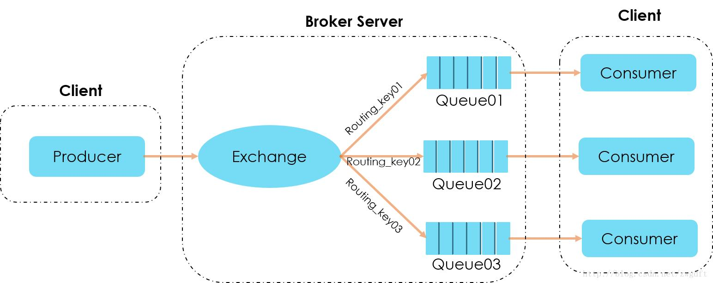

# RabbitMq

## 概念



### VHost 

- vhost可以理解为虚拟broker，即mini-RabbitMQ server，其内部均含有独立的queue、bind、exchange等，最重要的是拥有**独立的权限系统**，可以做到vhost范围内的用户控制。当然，从RabbitMQ全局角度，vhost可以作为不同权限**隔离**的手段(一个典型的例子，不同的应用可以跑在不同的vhost中)。

### Exchange 交换机

- 用于按规则将消息投递到指定的队列中

### Queue 队列

- 用于存储消息

###  Binding 绑定关系

- 用于将队列按照指定的匹配规则绑定到队列上(相当于正则表达式)

###  RoutingKey  路由键

- 用于匹配相应的绑定规则(相当于正则表达式要匹配的字符串)

###  Exchange Type 

- fanout

  fanout会把所有发送到该交换器的消息路由到**所有**与该交换器绑定的队列中。

- direct

  direct类型的交换器会把消息路由到那些BindingKey和RoutingKey**完全匹配**的队列中。

-  topic 

  -  采用**模糊匹配**的方式，可以通过通配符满足一部分规则就可以传送

- headers

  -  根据发送的消息内容中的 *headers* 属性进行匹配 
  - 会导致性能下降,实际中很少使用

## 工作模式


## 集群

## 消息不丢失

### 消息持久化

1. Exchange 设置持久化

2. Queue 设置持久化
3. Message持久化发送：发送消息设置发送模式deliveryMode=2，代表持久化消息

### 生产者

#### 事务模式(性能低)

```Java
try{
    // 开启事务
	channel.txSelect();
    // 进行消息发送
    channel.basicPublish("x-hello", "test", true, MessageProperties.PERSISTENT_BASIC, 消息体);
	//提交事务
	channel.txCommit() ;
catch(Exception e){
    // ：回滚事务
	channel.txRollback();
}

```

#### confirm模式(高性能)

> confirm模式下,消息如果被成功投递, 或者如果消息和队列是可持久化的，那么确认消息会将消息写入磁盘之后. 会返回消息确认结果
>
> confirm模式**只确保消息发送到交换机**.若交换机转发至队列失败时不会执行该回调函数中的方法.
>
> 同步性能是事务模式5倍左右,批量和异步性能是事务模式10倍左右

##### return模式 

 确保消息从**交换机发送到队列**，在发送失败的情况下Exchange有两种处理失败消息的模式，**一种直接丢弃失败消息（默认是此种模式处理）**，**一种将失败消息发送给ReturnCallBack** 

##### 同步方式

```java
try {
    // 开启发布确认模式
    channel.confirmSelect();
	// 发送消息
    channel.basicPublish("x-hello", "test", true, MessageProperties.PERSISTENT_BASIC, ("第" + (i + 1) + "条消息").getBytes());
    // 阻塞方法，直到mq服务器确认消息
    // channel.waitForConfirmsOrDie() 批量确认消息
    if (channel.waitForConfirms()) {
        log.info("消息发送成功");
    }
} catch (Exception e) {
    // 发生异常，说明消息没有到达broker的queue中，回滚。
    log.error("mq broker error...");
}
```

##### 异步方式

```java
// 开启confirm模式, 模拟发送一千条消息，记录总耗时
	
// return模式只有消息投递失败才会回调,成功不回调. 用于处理路由失败的消息
  rabbitTemplate.setReturnCallback((message, replyCode, replyText, exchange, routingKey) -> {
      String correlationId = message.getMessageProperties().getCorrelationIdString();
      log.debug("消息：{} 发送失败, 应答码：{} 原因：{} 交换机: {}  路由键: {}", correlationId, replyCode, replyText, exchange, routingKey);
  });

  // confirm模式消息投递结果始终会返回. 
  rabbitTemplate.setConfirmCallback((CorrelationData correlationData, boolean ack, String cause) -> {
      if (ack) {
          System.out.println("消息id为: " + correlationData + "的消息，已经被ack成功");
      } else {
          System.out.println("消息id为: " + correlationData + "的消息，消息nack，失败原因是：" + cause);
      }
  });

  // 开启连接 - tcp连接
  // 准备发送一万条测试消息
  long start = System.currentTimeMillis();
      rabbitTemplate.convertAndSend("x-hello", "test", ("第" + (i + 1) + "条消息").getBytes(), new CorrelationData("111"));
```


### 消费端手动ACK确认

```Java
//第二个参数值为false代表关闭RabbitMQ的自动应答机制，改为手动应答。
channel.basicConsume(QUEUE_NAME, false, consumer);

//在处理完消息时，返回应答状态。
channel.basicAck(delivery.getEnvelope().getDeliveryTag(), false);
//不签收消息
channel.basicNack(long deliveryTag, boolean multiple, boolean requeue)：
```

### 设置集群镜像模式

RabbitMQ三种部署模式：

1. 单节点模式：最简单的情况，非集群模式，节点挂了，消息就不能用了。业务可能瘫痪，只能等待。
2. 普通模式：默认的集群模式，某个节点挂了，该节点上的消息不能用，有影响的业务瘫痪，只能等待节点恢复重启可用（必须持久化消息情况下）。
3. 镜像模式：把需要的队列做成镜像队列，存在于多个节点，属于RabbitMQ的HA方案

### 消息补偿机制

```properties
# 开启重试
spring.rabbitmq.listener.simple.retry.enabled=true
# 重试次数,默认为3次
spring.rabbitmq.listener.simple.retry.max-attempts=5
```

### 死信队列

- 进入死信队列的条件
  - 拒收. 消息被否定确认，使用 `channel.basicNack` 或 `channel.basicReject` ，并且此时`requeue` 属性被设置为`false`。
  - 过期. 消息在队列的存活时间超过设置的TTL时间。
  - 队列超限. 消息队列的消息数量已经超过最大队列长度。
- 配置死信队列
  - 为业务队列配置死信交换机和路由key
  - 为死信交换机配置死信队列

## 消息不重复

### 不重复投递

- 每次给消息增加唯一id

### 不重复消费

- 每次消费消息时先在DB里插入一条日志,日志的消息id设置唯一键,如果插入失败则表示消息已经被投递过,则不需要再消费
- 

