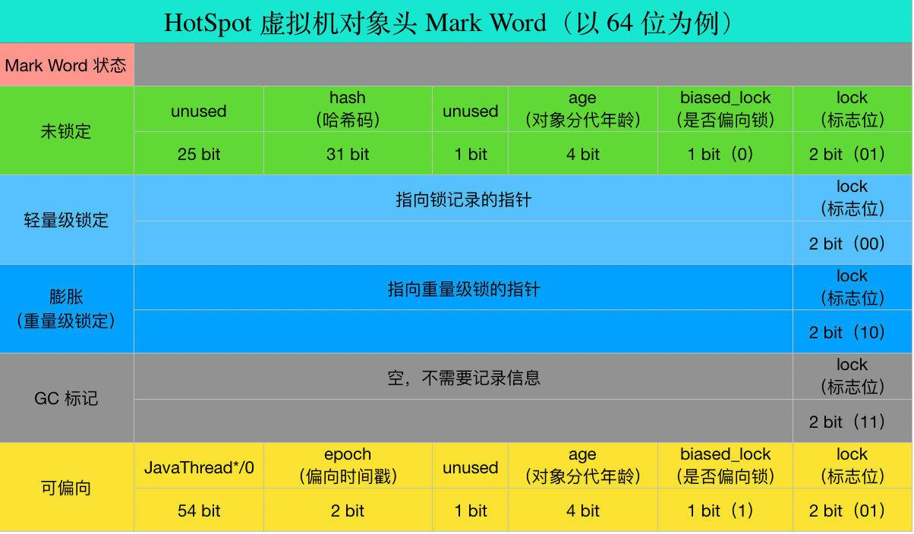

# Synchronized

## 作用机制

### 作用范围


### 字节码

#### 锁代码块

> flags: ACC_SYNCHRONIZED

#### 锁方法

> 一个入口monitorenter
>
> 两个出口monitorexit(方法正常退出和异常退出)

### C++实现

```C++
//结构体如下
ObjectMonitor() {
    _count        = 0; //记录数
    _recursions   = 0; //锁的重入次数
    _owner        = NULL; //指向持有ObjectMonitor对象的线程 
    _WaitSet      = NULL; //调用wait后，线程会被加入到_WaitSet
    _EntryList    = NULL ; //等待获取锁的线程，会被加入到该列表
}
```


## 锁膨胀

### 对象结构

#### 对象头

##### markword



##### Klass Pointer

>  Klass Point 是对象指向它的类元数据的指针，虚拟机通过这个指针来确定这个对象是哪个类的实例（**即指向方法区类的模版信息**） 

##### 数组长度

> 只有当对象是数组的时候才有

#### 实例数据

#### 对齐填充

### 锁

1. 膨胀过程：无锁（锁对象初始化时）-> 偏向锁（有线程请求锁） -> 轻量级锁（2个线程竞争且自旋获取到锁）-> 重量级锁（线程过多或长耗时操作，线程自旋过度消耗cpu）；

2. jvm默认延时4s自动开启偏向锁（此时为**匿名偏向锁**，不指向任务线程），可通过-XX:BiasedLockingStartUpDelay=0取消延时；如果不要偏向锁，可通过-XX:-UseBiasedLocking = false来设置

3. 锁只能升级，不能降级；偏向锁可以被重置为无锁状态

4. 偏向锁对象头记录占用锁的线程信息，但不能主动释放，线程栈同时记录锁的使用信息，当有其他线程（T1）申请已经被占用的锁时，先根据锁对向的信息，找对应线程栈，若线程已结束，则锁对象先被置为无锁状态，再被T1线程占有后置为偏向锁；若线程位结束，则锁状态由当前偏向锁升级为轻量级锁。

5. 偏向锁和轻量级锁在用户态维护，重量级锁需要切换到内核态(os)进行维护；
6. 偏向锁用于同一线程不同时间使用,轻量级锁用于不同线程不同时间段使用(无并发竞争),重量级锁用于不同线程同一时间竞争使用

